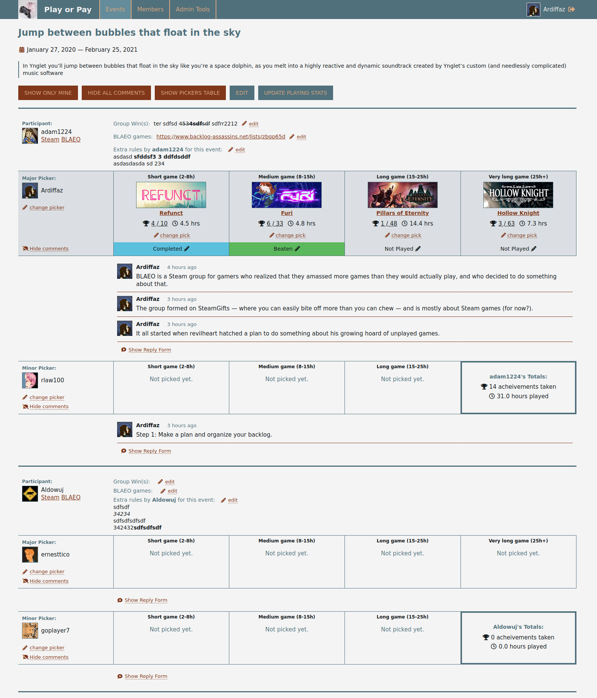
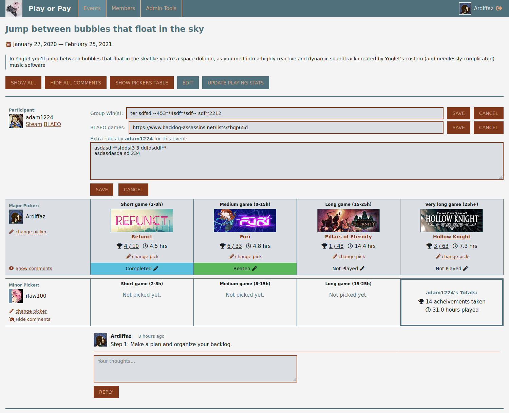
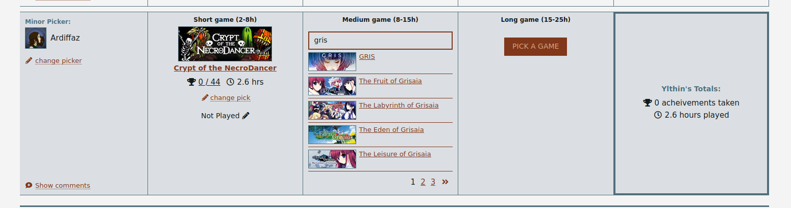
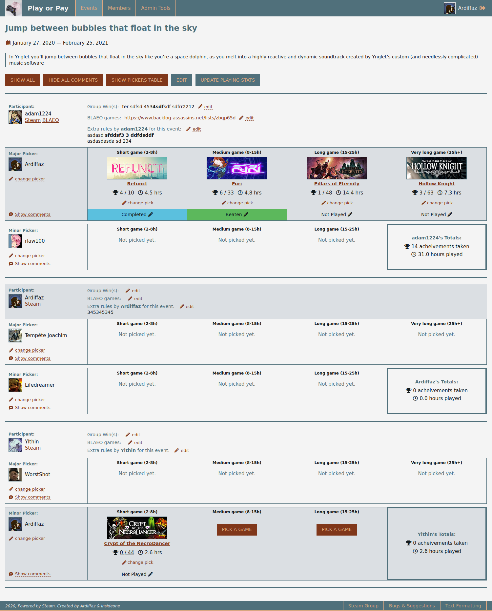

# Play or Pay website

Basic rule: admin can change anything.
Admin role can be granted via a console command, and also by another admin on members page.
All editable text fields support markdown for text format. There's a page with examples of how to use markdown.

## Pages:

#### Members Page

 
 
 List of users, options to edit their Blaeo links, extra rules, set activity and grant/revoke admin role.
Each member can edit their own Blaeo link and their own rules. It will be their default rules (so they don't need to fill the same text for each event, but they are still able to change rules for a specific event - on event's page.)
If user is not "active" at the moment of new event creation, they will not be added to the event, but admin can still add them later manually through "add participant" button on event page.

---

#### Admin Tools Page

A simple page with a button to update group info and members list, and a button to import Steam games titles (with app ids).
Group identificator is taken from group page link, i.e. "PoPSG" is taken from "steamcommunity.com/groups/PoPSG".

---
 
#### Create New Event Page

Create a new event page. Description is not mandatory. Starting and ending date don't affect anything, they serve only informational purpose.

---

#### List of All Events Page

List of all created events, sorted by ending date.

---

#### Event Page

Basic features: view participant and their pickers, view and edit participant params (blaeo games, group wins) and their picks.
Right after the event is created, there is an option (for admin) to generate pickers, but also pickers can be set or changed manually (by admin).
Admin can add a new participant from a list of possible participants: these are users who are members of the group but not participants. Useful for people who were inactive in the moment of event creation or for people who joined group after the event was created.
Button to update playstats (playtimes and achievements), works for "profile features limited" games too. This button is available only for admins.

Participant fields can be edited (by participant themselves or admin).
Added comments can be seen by anyone, but new comments can be added only by the participant, the picker or an admin.
Pick status (unfinished/beaten/completed/abandoned) can be changed by participant or admin by clicking on it and selecting a new status in dropdown list.

An example to show picking a game: click "Pick a game", then type a game name (or ID) and click on a game to choose it.
After the game is picked, it can be changed.

Example of "show only mine" filter. Three entries are shown: where the logged user is the participant, or minor picker, or major picker.
Since the logged user is admin, they can edit anything, but usual members won't see so many "edit" links.
The comments blocks are hidden on the screenshot for compact view, but they can be shown any time.

Pickers table is just a compact way to see all participant/pickers combo at once
